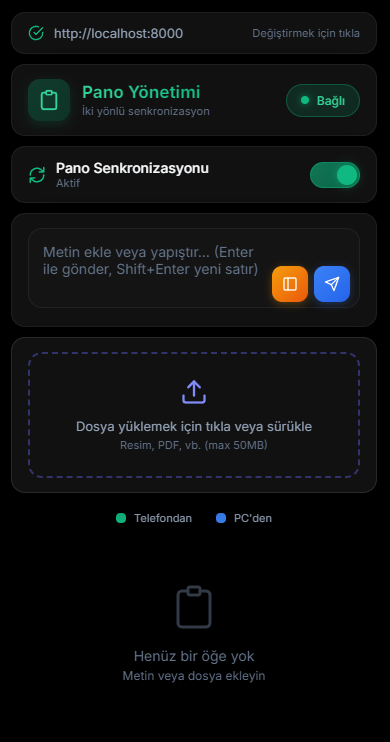
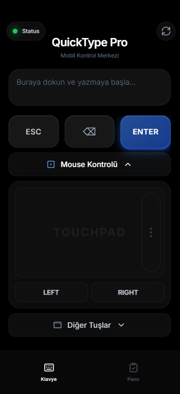
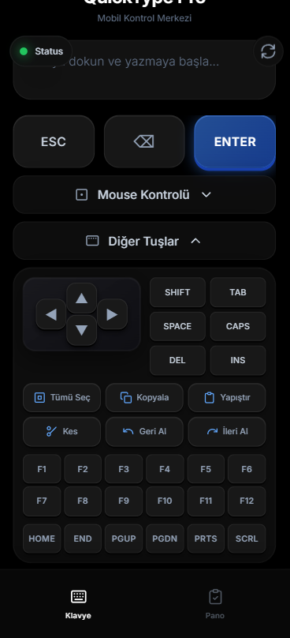
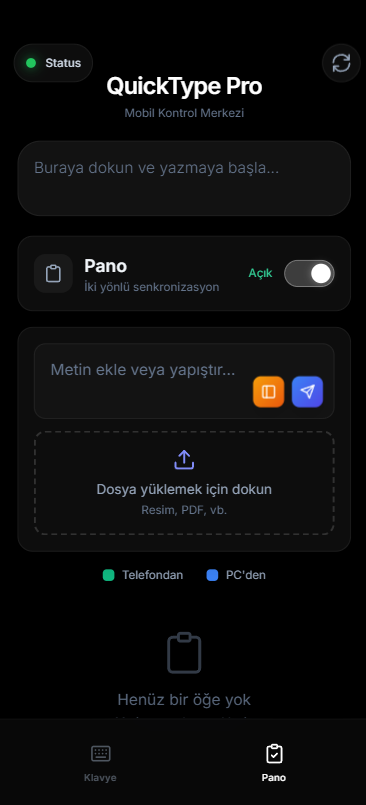

<div align="center">

# ⌨️ QuickType Pro

**Steuern Sie Ihren Computer von Ihrem Telefon aus**


*Electron-Desktop-App für PC und Web-Interface für mobile Geräte*

---

### 🌍 Sprachen / Languages

[🇬🇧 English](README.md) | [🇹🇷 Türkçe](README.tr.md) | [🇩🇪 Deutsch](README.de.md) | [🇫🇷 Français](README.fr.md) | [🇪🇸 Español](README.es.md) | [🇨🇳 中文](README.zh.md)

---

</div>

## ✨ Funktionen

| Funktion | 📱 Mobil | 🖥️ PC (Electron) |
|----------|:--------:|:----------------:|
| ⌨️ Fernbedienung Tastatur | ✅ | ❌ |
| 🖱️ Touchpad/Maus | ✅ | ❌ |
| 📋 Zwischenablage-Sync | ✅ | ✅ |
| 📁 Dateifreigabe | ✅ | ✅ |
| 🔄 System Tray | ❌ | ✅ |
| 🌓 Hell/Dunkel-Modus | ✅ | ✅ |
| 🌍 Mehrsprachig | ✅ | ✅ |

---

## 📸 Screenshots

### 🖥️ Electron Desktop-Anwendung

<div align="center">

</div>

### 📱 Mobile Web-Oberfläche

<div align="center">
<table>
<tr>
<td align="center"><br/><b>Tastatur</b></td>
<td align="center"><br/><b>Touchpad</b></td>
</tr>
<tr>
<td align="center"><br/><b>Sondertasten</b></td>
<td align="center"><br/><b>Zwischenablage</b></td>
</tr>
</table>
</div>

---

## 🔒 Sicherheit

Diese Anwendung ist für den Betrieb in Ihrem lokalen Netzwerk konzipiert:

- ✅ Rate Limiting (DDoS-Schutz)
- ✅ Eingabevalidierung
- ✅ Path-Traversal-Schutz
- ✅ Verbindungsprotokollierung
- ✅ Sicherheits-Header (CSP, XSS, etc.)

> ⚠️ **Warnung**: Verwenden Sie diese Anwendung nur in vertrauenswürdigen Netzwerken!

---

## 🚀 Schnellstart

### Anforderungen

- Python 3.8+
- Node.js 16+ (für Electron)
- Windows 10/11

### Installation

```bash
# 1. Repository klonen
git clone https://github.com/IHR_BENUTZERNAME/klavye.git
cd klavye

# 2. Python-Abhängigkeiten installieren
pip install -r requirements.txt

# 3. Backend starten
python main.py
```

### 📱 Mobiler Zugriff

1. Notieren Sie sich die IP-Adresse, die im Terminal angezeigt wird
2. Öffnen Sie `http://[PC_IP]:8000` im Browser Ihres Telefons
3. Nutzen Sie alle Funktionen!

### 🖥️ Electron (PC) Einrichtung

```bash
cd electron-app
npm install
npm start
```

---

## 🔧 Entwicklermodus

### Backend
```bash
# Im Debug-Modus starten
$env:LOG_LEVEL="DEBUG"
python main.py
```

### Electron
```bash
cd electron-app
npm run dev
```

### Produktions-Build
```bash
cd electron-app
npm run dist
```

---

## ⚙️ Konfiguration

| Umgebungsvariable | Standard | Beschreibung |
|-------------------|----------|--------------|
| `LOG_LEVEL` | `INFO` | Log-Level (DEBUG, INFO, WARNING, ERROR) |
| `CORS_ORIGINS` | `*` | Erlaubte CORS-Origins |

### Beispielkonfiguration

```powershell
# Zugriff nur von bestimmten IPs erlauben
$env:CORS_ORIGINS="http://192.168.1.100:8000,http://192.168.1.101:8000"
python main.py
```

---

## 📦 Projektstruktur

```
📁 QuickType-Pro/
├── 📄 main.py              # Python-Backend-Einstiegspunkt
├── 📄 requirements.txt     # Python-Abhängigkeiten
├── 📁 app/                 # Backend-Module
│   ├── config.py           # Konfiguration
│   ├── security.py         # Sicherheitsfunktionen
│   ├── middleware.py       # HTTP-Middleware
│   ├── routes.py           # API-Endpunkte
│   ├── controllers.py      # Tastatur-/Maussteuerung
│   ├── socket_events.py    # WebSocket-Events
│   └── clipboard_manager.py # Zwischenablage-Verwaltung
├── 📁 static/              # Mobile Web-Oberfläche
├── 📁 electron-app/        # Desktop-Anwendung
└── 📁 uploads/             # Geteilte Dateien
```

---

## 🐛 Fehlerbehebung

<details>
<summary><b>Backend startet nicht</b></summary>

```bash
pip install -r requirements.txt --upgrade
```
</details>

<details>
<summary><b>Verbindung nicht möglich</b></summary>

1. Port 8000 in der Firewall öffnen
2. Stellen Sie sicher, dass PC und Telefon im selben Netzwerk sind
3. Antivirensoftware vorübergehend deaktivieren
</details>

<details>
<summary><b>Zwischenablage funktioniert nicht (Windows)</b></summary>

```bash
pip install pywin32 --upgrade
```
</details>

---

## 📄 Lizenz

Dieses Projekt ist unter der [MIT-Lizenz](LICENSE) lizenziert.

---

<div align="center">

Mit ❤️ gemacht mit **QuickType Pro**

</div>
