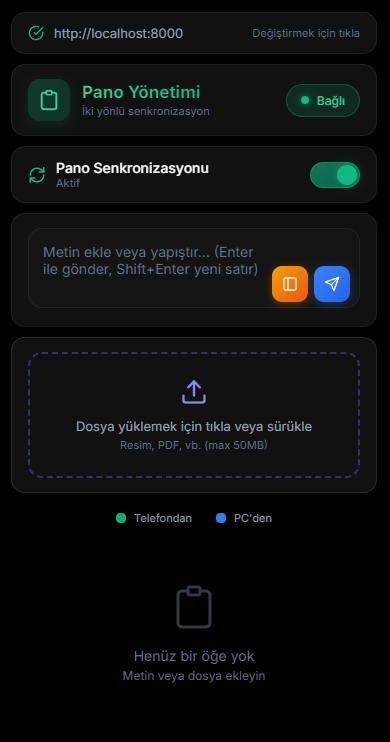
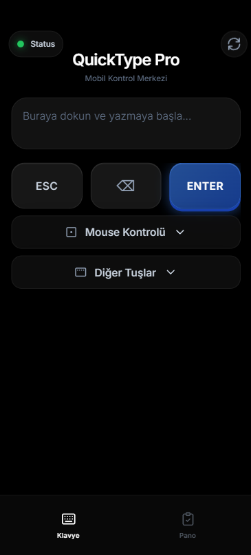
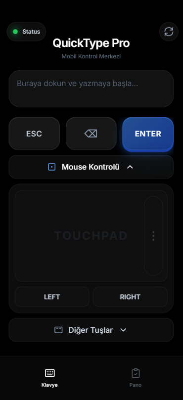
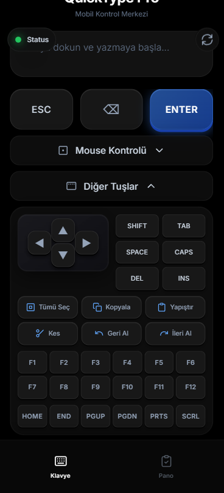
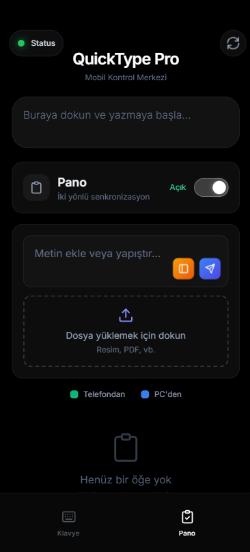

<div align="center">

# ⌨️ QuickType Pro

**Control your computer from your phone**


*Electron desktop app for PC and web interface for mobile devices*

---

### 🌍 Languages / Diller

[🇬🇧 English](README.md) | [🇹🇷 Türkçe](README.tr.md)

---

</div>

## ✨ Features

| Feature | 📱 Mobile | 🖥️ PC (Electron) |
|---------|:--------:|:----------------:|
| ⌨️ Remote Keyboard | ✅ | ❌ |
| 🖱️ Touchpad/Mouse | ✅ | ❌ |
| 📋 Clipboard Sync | ✅ | ✅ |
| 📁 File Sharing | ✅ | ✅ |
| 🔄 System Tray | ❌ | ✅ |
| 🌓 Dark/Light Theme | ✅ | ✅ |
| 🌍 Multi-language | ✅ | ✅ |

---

## 📸 Screenshots

### 🖥️ Electron Desktop Application

<div align="center">

</div>

### 📱 Mobile Web Interface

<div align="center">
<table>
<tr>
<td align="center"><br/><b>Keyboard</b></td>
<td align="center"><br/><b>Touchpad</b></td>
</tr>
<tr>
<td align="center"><br/><b>Special Keys</b></td>
<td align="center"><br/><b>Clipboard</b></td>
</tr>
</table>
</div>

---

## 🔒 Security

This application is designed to work on your local network:

- ✅ **HTTPS Only** - HTTP connections are disabled
- ✅ **SSL/TLS** encryption for all traffic
- ✅ HSTS (HTTP Strict Transport Security)
- ✅ WebAuthn/Face ID ready infrastructure
- ✅ Rate limiting (DDoS protection)
- ✅ Input sanitization
- ✅ Path traversal protection
- ✅ Connection logging
- ✅ Security headers (CSP, XSS, COOP, etc.)

> 🔐 **Security Note**: The application requires HTTPS certificates to run. HTTP is completely disabled for security.

> ⚠️ **Warning**: Only use this application on trusted networks!

### 🔐 HTTPS Setup (Recommended)

For secure connections and Face ID support, HTTPS is configured **from within the app**:

1. Open QuickType Pro
2. Go to **Settings** (⚙️) → **HTTPS / Security**
3. Click "**Setup HTTPS**"
4. Done! Access via `https://[PC_IP]:8000`

#### 📱 Phone Certificate Setup

1. In Settings, click "**Export for Phone**"
2. Send the `QuickType-RootCA.crt` file to your phone
3. Install:
   - **iPhone**: Settings → General → VPN & Device Management → Install
   - **Android**: Open file → Install as CA Certificate

> 💡 **Note**: You only need to install the Root CA once. It remains valid even when certificates are renewed.

#### 🔄 IP Address Changes

If your PC's IP address changes:
- The app will show a warning in Settings
- Click "**Renew Certificate**" - the app will automatically restart
- No need to reinstall the phone certificate!

> 💡 **Tip**: Set a static IP in Windows Network Settings to avoid this issue permanently.

---

## 🚀 Quick Start

### Requirements

- Python 3.8+
- Node.js 16+ (for Electron)
- Windows 10/11

### Installation

```bash
# 1. Clone the repository
git clone https://github.com/ozymandias-get/quicktype-pro.git
cd quicktype-pro

# 2. Install Python dependencies
pip install -r requirements.txt

# 3. Start the backend
python main.py
```

### 📱 Mobile Access

1. First, set up HTTPS certificates (see Security section above)
2. Note the IP address shown when starting the app
3. Go to `https://[PC_IP]:8000` from your phone's browser
4. Start using all features!

### 🖥️ Electron (PC) Setup

```bash
cd electron-app
npm install
npm start
```

---

## 🔧 Developer Mode

### Backend
```bash
# Start in debug mode
$env:LOG_LEVEL="DEBUG"
python main.py
```

### Electron
```bash
cd electron-app
npm run dev
```

### Production Build
```bash
cd electron-app
npm run dist
```

---

## ⚙️ Configuration

| Environment Variable | Default | Description |
|---------------------|---------|-------------|
| `LOG_LEVEL` | `INFO` | Log level (DEBUG, INFO, WARNING, ERROR) |
| `CORS_ORIGINS` | `*` | Allowed CORS origins |

### Example Configuration

```powershell
# Allow access only from specific IPs
$env:CORS_ORIGINS="https://192.168.1.100:8000,https://192.168.1.101:8000"
python main.py
```

---

## 📦 Project Structure

```
📁 QuickType-Pro/
├── 📄 main.py                  # Python backend entry point
├── 📄 requirements.txt         # Python dependencies
├── 📁 app/                     # Backend modules
│   ├── __init__.py             # Package init
│   ├── config.py               # Configuration & constants
│   ├── security.py             # Rate limiting, validation
│   ├── middleware.py           # HTTP security middleware
│   ├── routes.py               # API endpoints
│   ├── controllers.py          # Keyboard/Mouse control
│   ├── socket_events.py        # WebSocket events
│   ├── clipboard_manager.py    # Clipboard sync & file sharing
│   └── utils.py                # Helper functions
├── 📁 static/                  # Mobile web interface (PWA)
│   ├── index.html              # Mobile UI
│   ├── manifest.json           # PWA manifest
│   └── sw.js                   # Service worker
├── 📁 electron-app/            # Desktop application
│   ├── main.js                 # Electron entry point
│   ├── preload.js              # Preload script
│   ├── certificateManager.js   # HTTPS certificate management
│   ├── 📁 modules/             # Modular architecture
│   │   ├── settings.js         # Settings management
│   │   ├── backend.js          # Python backend control
│   │   ├── window.js           # Window & tray management
│   │   ├── updater.js          # Auto-update system
│   │   ├── ipc-handlers.js     # IPC communication
│   │   └── https-manager.js    # HTTPS IPC handlers
│   ├── 📁 src/                 # React frontend
│   └── 📁 public/              # Static assets
├── 📁 certs/                   # SSL certificates (auto-generated)
├── 📁 tests/                   # Unit tests
├── 📁 uploads/                 # Shared files storage
└── 📁 .github/workflows/       # CI/CD (GitHub Actions)
```

---

## 🐛 Troubleshooting

<details>
<summary><b>Backend won't start</b></summary>

```bash
pip install -r requirements.txt --upgrade
```
</details>

<details>
<summary><b>Cannot connect</b></summary>

1. Open port 8000 in your firewall
2. Make sure PC and phone are on the same network
3. Temporarily disable antivirus software
</details>

<details>
<summary><b>Clipboard not working (Windows)</b></summary>

```bash
pip install pywin32 --upgrade
```
</details>

---

## 📄 License

This project is licensed under the [MIT License](LICENSE).

---

<div align="center">

Made with ❤️ using **QuickType Pro**

</div>
