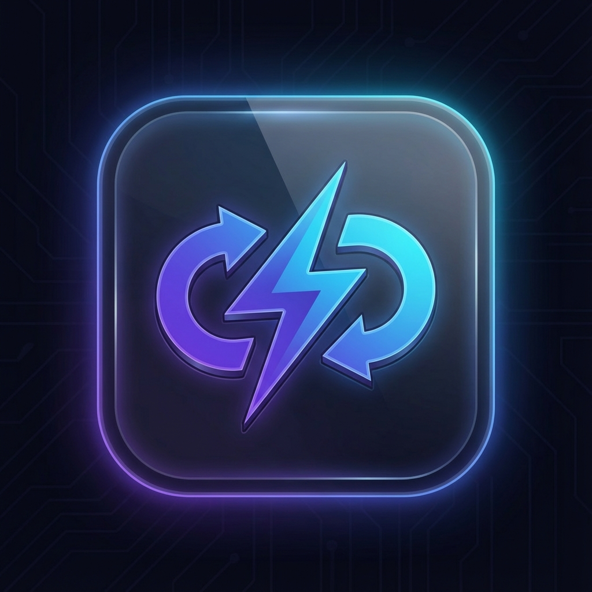

# QuickType Pro - Electron Desktop Application

<p align="center">
  
</p>

## Açıklama
Bu, QuickType Pro uygulamasının Electron masaüstü sürümüdür. Sadece **Pano Yönetimi** özelliğini içerir.
Mouse ve klavye kontrolü bu sürümde yoktur - bu özellikler sadece mobil tarayıcı arayüzünde mevcuttur.

## ✨ Özellikler

### Temel Özellikler
- ✅ İki yönlü pano senkronizasyonu
- ✅ Metin paylaşımı (PC ↔ Telefon)
- ✅ Dosya paylaşımı
- ✅ System tray entegrasyonu
- ✅ Modern glassmorphism tasarım
- ❌ Klavye kontrolü (sadece mobilden)
- ❌ Mouse/Touchpad kontrolü (sadece mobilden)

### 🎨 Tema ve Görünüm
- 🌙 **Koyu Mod** - Göz yormayan siyah tema
- ☀️ **Açık Mod** - Aydınlık ortamlar için beyaz tema
- 💻 **Sistem Varsayılanı** - Windows temasını takip eder

### 🚀 Başlangıç Ayarları
- **Windows ile Başlat** - Bilgisayar açıldığında otomatik başlatma
- **Arka Planda Başlat** - Sistem tepsisinde minimized olarak başlama

### ⌨️ Kısayollar
- `Ctrl+Shift+Q` - Uygulamayı her yerden açıp kapatma (Global Hotkey)

### 🎬 Animasyonlar ve Efektler
- ✨ **Yeni öğe highlight efekti** - Eklenen öğeler yeşil pulse ile vurgulanır
- 🗑️ **Silme animasyonu** - Fade-out efekti ile yumuşak geçiş
- 💫 **Bağlantı pulse efekti** - Bağlantı durumu görsel geri bildirimi
- 📊 **Dosya yükleme progress bar** - Yükleme durumu göstergesi

### 📱 Mobil Dokunmatik Özellikler
- 👆 **Swipe ile silme** - Sola kaydırarak hızlı silme
- 🔄 **Pull-to-refresh** - Aşağı çekerek yenileme (yakında)

### 🔌 Bağlantı Yönetimi
- 🔄 **Retry butonu** - Bağlantı kesildiğinde tek tıkla yeniden bağlanma
- 📝 **Detaylı hata mesajları** - Sorunun ne olduğunu anlama
  - Sunucuya ulaşılamıyor
  - Bağlantı zaman aşımı
  - Ağ hatası
  - Bilinmeyen hata

### 🌍 Çoklu Dil Desteği
- 🇬🇧 English
- 🇹🇷 Türkçe
- 🇩🇪 Deutsch
- 🇫🇷 Français
- 🇪🇸 Español
- 🇨🇳 中文

## 📥 Kurulum

### 1. Bağımlılıkları yükleyin
```bash
cd electron-app
npm install
```

### 2. Development modunda çalıştırın
```bash
npm run dev
```

### 3. Production build
```bash
npm run build
```

### 4. Executable oluştur
```bash
npm run dist
```

## 🎮 Kullanım

1. **Backend'i başlatın** (ana klasörde):
   ```bash
   python main.py
   ```

2. **Electron uygulamasını başlatın**:
   ```bash
   cd electron-app
   npm start
   ```

3. **Mobil arayüz için**: Telefonunuzun tarayıcısından `http://[BILGISAYAR_IP]:8000` adresine gidin

## 🏗️ Mimari

```
quicktype-pro/
├── main.py                 # Python backend giriş noktası
├── app/                    # Python backend modülleri
│   ├── clipboard_manager.py
│   ├── controllers.py      # Keyboard/Mouse (mobil için)
│   ├── socket_events.py
│   └── ...
├── static/                 # Mobil web arayüzü (tüm özellikler)
│   ├── index.html
│   └── app.js
└── electron-app/           # Electron desktop (sadece pano)
    ├── main.js             # Electron ana işlem
    ├── preload.js          # IPC köprüsü
    ├── src/
    │   ├── App.js          # Ana React bileşeni
    │   ├── components/     # UI bileşenleri
    │   │   ├── Settings.js       # Ayarlar paneli
    │   │   ├── ClipboardList.js  # Pano listesi
    │   │   ├── ClipboardItem.js  # Pano öğesi
    │   │   └── ...
    │   ├── styles/
    │   │   └── index.css   # Tema ve stiller
    │   └── i18n/
    │       └── translations.js  # Çoklu dil desteği
    └── public/
```

## ⚙️ Ayarlar

Ayarlar menüsüne erişmek için sağ üst köşedeki ⚙️ simgesine tıklayın:

| Ayar | Açıklama |
|------|----------|
| **Tema** | Koyu, Açık veya Sistem varsayılanı |
| **Dil** | 6 farklı dil seçeneği |
| **Başlangıçta Çalıştır** | Windows ile otomatik başlatma |
| **Arka Planda Başlat** | Minimized olarak başlama |

## ⌨️ Klavye Kısayolları

| Kısayol | İşlev |
|---------|-------|
| `Ctrl+Shift+Q` | Uygulamayı aç/kapat (global) |

## 📝 Notlar
- Electron uygulaması çalışması için Python backend'in çalışıyor olması gerekir
- Backend varsayılan olarak `http://localhost:8000` adresinde çalışır
- Farklı bir adreste çalışıyorsa, Electron uygulamasından sunucu adresini değiştirebilirsiniz
- Tema ve başlangıç ayarları otomatik olarak kaydedilir

## 🔧 Teknolojiler

- **Frontend**: React, CSS3 (Glassmorphism)
- **Desktop**: Electron
- **Backend**: Python, FastAPI, Socket.IO
- **Paketleme**: electron-builder

## 📄 Lisans

MIT License - Detaylar için [LICENSE](../LICENSE) dosyasına bakın.
